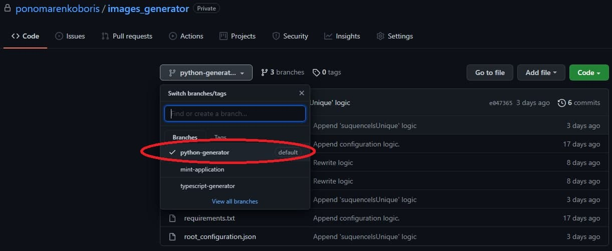
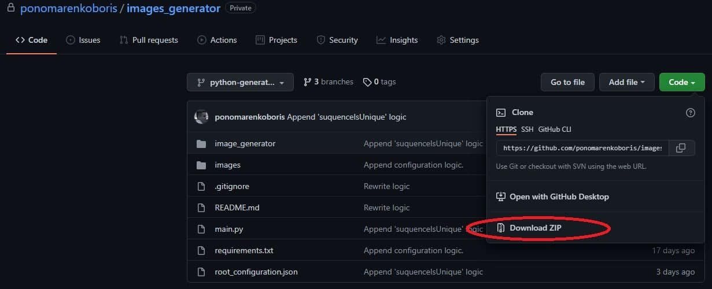

# Гнератор коллекций (Python)

**Для испольлзования программы необходимо установить:**
* [Python](https://www.python.org/downloads/)
***
### Руководство по использованию программы
1. Клонировать директорю:
    ```cmd
    git clone https://github.com/ponomarenkoboris/images_generator.git
    ```
   **ИЛИ**

    Выбрать необходимую ветку:

    
    
    Скачать архив:
    
    

2. Из установленной папки запустить команду для установки зависимостей:
    ```cmd
    pip install -r requirements.txt
    ```
3. Запуск программы:
    ```cmd
   python main.py
    ```
4. После завершения исполнения программы будет сгенерированная папка assets с изображениями 
и метадатой  

&nbsp;
## root_configuration.json
### _token_metadata_ - информация, чтобы сгенерировть NFT токен
Посмотреть полную документацию **Token Metadata Standard** можно [здесь](https://docs.metaplex.com/nft-standard).

Название поля            | Тип данных |  Описание
|:---------------------: |:----------:|:-----------------------------------------------------:|
name                     | string     | Название арта (изменяемое поле)
symbol                   | string     | Символ арта (изменяемое поле)
description              | string     | Описние арта (изменяемое поле)
seller_fee_basis_points  | number     | Роялтис отчисляемые создателям (5% - 500; 10% - 1000) (изменяемое поле)
image                    | string     | URL картинки (неизменяемое поле) 
attributes               | array      | Содержит описание частей, из которых состоит арт (генерируемое поле)
[collection](#collection)| object     | Содержит информацию о коллекции артов
[properties](#properties)| object     | Содержит информацию о создателях, файлах и категории

#### collection
Название поля | Тип данных | Описание
|:-----------:|:----------:|:----------------------------:|
name          | string     | Название коллекции (изменяемое поле)
family        | string     | Название семейства коллекции (изменяемое поле)

#### properties 
Название поля | Тип данных | Описание
|:-----------:|:----------:|:---------------------------------------------------------------:|
files         | array      | Массив объектов, которые содержат адрес и тип изображения (генерируемое поле)
category      | string     | Один из валидных типов (изменяемое поле)
creators      | array      | Массив объектов, которые содержат адерсс кошелка создателя и процент от seller_fee_basis_points (5% - 500; 10% - 1000) (изменяемое поле)
&nbsp;
### _output_image_configuration_ - информация, для управления роботой программы 
Название поля        | Тип данных         | Описание
|:------------------:|:------------------:|:------------------------------------------------:|
images_count         | number             | Колличество картинок, которое нужно сгенерировать
time_limit           | number или boolean | Ограничение по времени на генерицию картинок в секундах (default false - нет ограничения)
sequences_is_unique  | boolean            | true - создается максимальное возможное количество уникальных артов в пределах images_count; false - генерируетя images_count колличество изображений 
size                 | object             | Рзамер арта
backgroud_color_rgba | array              | Цвет фона арта (default rgba(255, 255, 255, 255), alpha 255 = 100%)