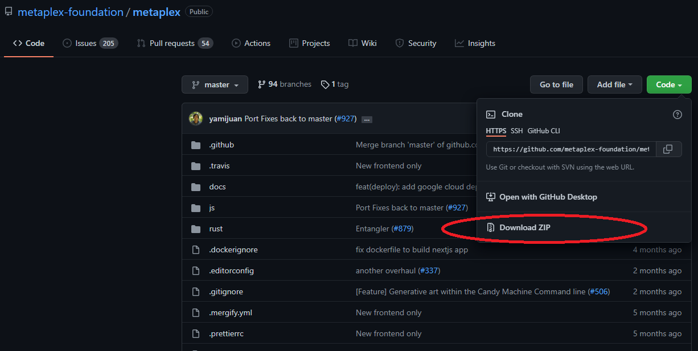
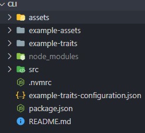
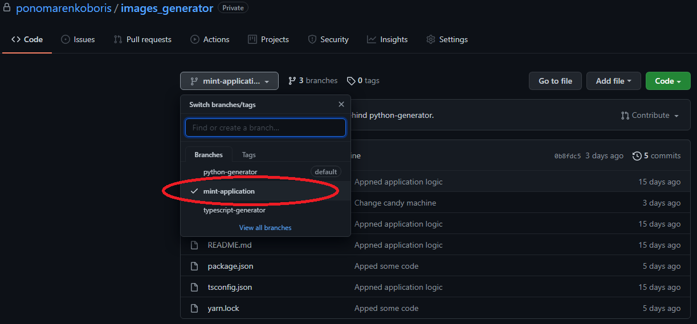
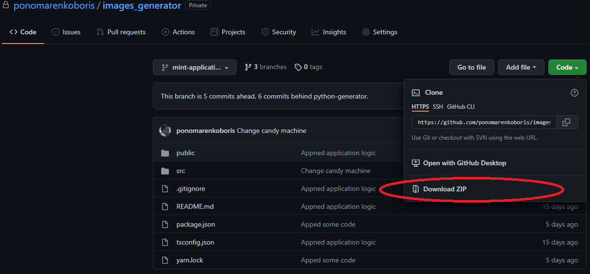

# Создание NFT коллекций
Чтобы иметь представление о том, что происходит лучше всего будет посмотреть [видео туториал](https://www.youtube.com/watch?v=35RO0lAEIxE). 
После просмтора сформируется пониамание этапов добычи NFT артов, что, в свою очередь, упростит работу. 
1. [Устанвока необходимых программ для создания NFT](#устанвока-необходимых-программ-для-создания-nft)
2. [Candy Machine для генерации NFT](#candy-machine-для-генерации-nft)
3. [Руководство по использованию программы](#руководство-по-использованию-программы)
***
## Устанвока необходимых программ для создания NFT
Для испольлзования программы необходимо установить:
* [**Node.js**](https://nodejs.org/en/download/) - Как установить смотреть [здесь](https://htmlacademy.ru/blog/boost/tools/installing-nodejs).
* [**yarn**](https://classic.yarnpkg.com/lang/en/docs/install/#windows-stable)
* [**ts-node**](https://www.npmjs.com/package/ts-node)
* [**Metaplex**](https://docs.metaplex.com/)
  - Клонировать [репозиторий](https://github.com/metaplex-foundation/metaplex)
  ```cmd
  git clone https://github.com/metaplex-foundation/metaplex.git
  ```
  **ИЛИ**
  - Скачать архив
  
* [**solana-cli**](https://docs.solana.com/cli/install-solana-cli-tools)
***
## Candy Machine для генерации NFT

Из папки metaplex переместиться в папку cli
```cmd
cd ./js/packages/cli
```
Установить зависимости
```cmd
yarn
```
Собрать проект
```cmd
yarn build
```
Необходимо переместить сгенерированные файлы в директорию проекта



> Если в директории существует папка .cache - её нужно удалить!

Загрузка коллекции (Стоимость: ~~0.00666304 SOL)
```cmd
ts-node ./src/candy-machine-cli.ts upload ./assets -e devnet -k путь_до_keypair
``` 

Верификация выгруженной коллекции
```cmd
ts-node ./src/candy-machine-cli.ts verify -k путь_до_keypair
```
Создание Candy Machine
```cmd
ts-node ./src/candy-machine-cli.ts create_candy_machine -k путь_до_keypair -e devnet -p стоимость_в_SOL
```
Установка даты запуска Candy Machine
```cmd
ts-node ./src/candy-machine-cli.ts update_candy_machine -d (needed timestamp or "now") -k путь_до_keypair
```
***
## Руководство по использованию программы
1. Клонировать директорю:
    ```cmd
    git clone https://github.com/ponomarenkoboris/images_generator.git
    ```
   **ИЛИ**

    Выбрать необходимую ветку:

    
    
    Скачать архив:
    
    

2. Из установленной папки запустить команду для установки зависимостей
    ```cmd
    yarn
    ```
3. Запуск программы:
    ```cmd
   yarn start
    ```
4. После завершения исполнения программы будет сгенерированная папка assets с изображениями 
и метадатой  
